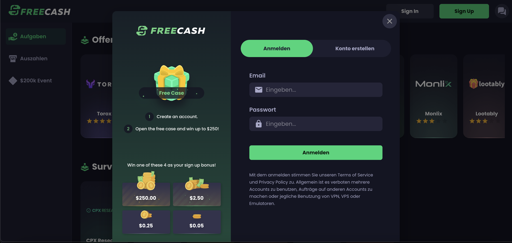
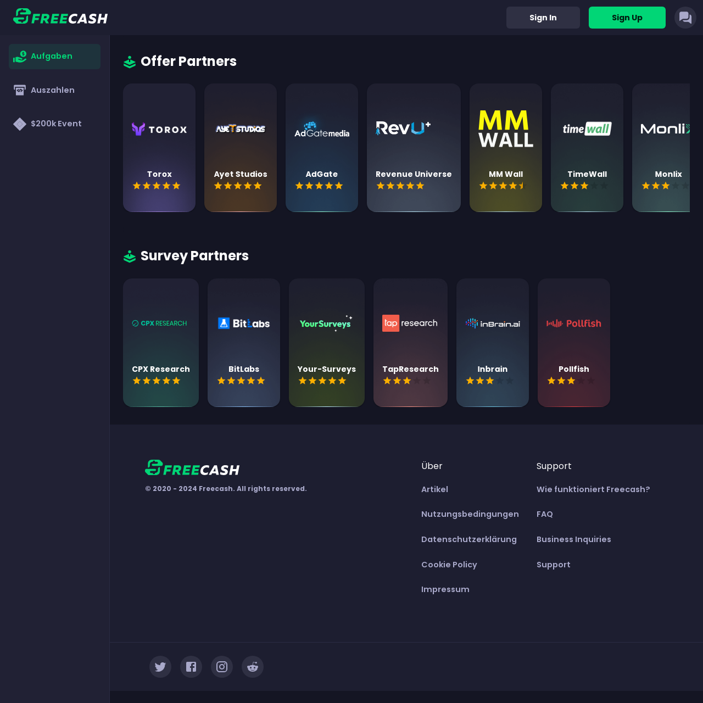
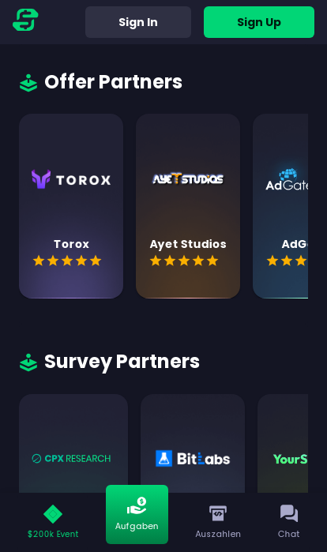
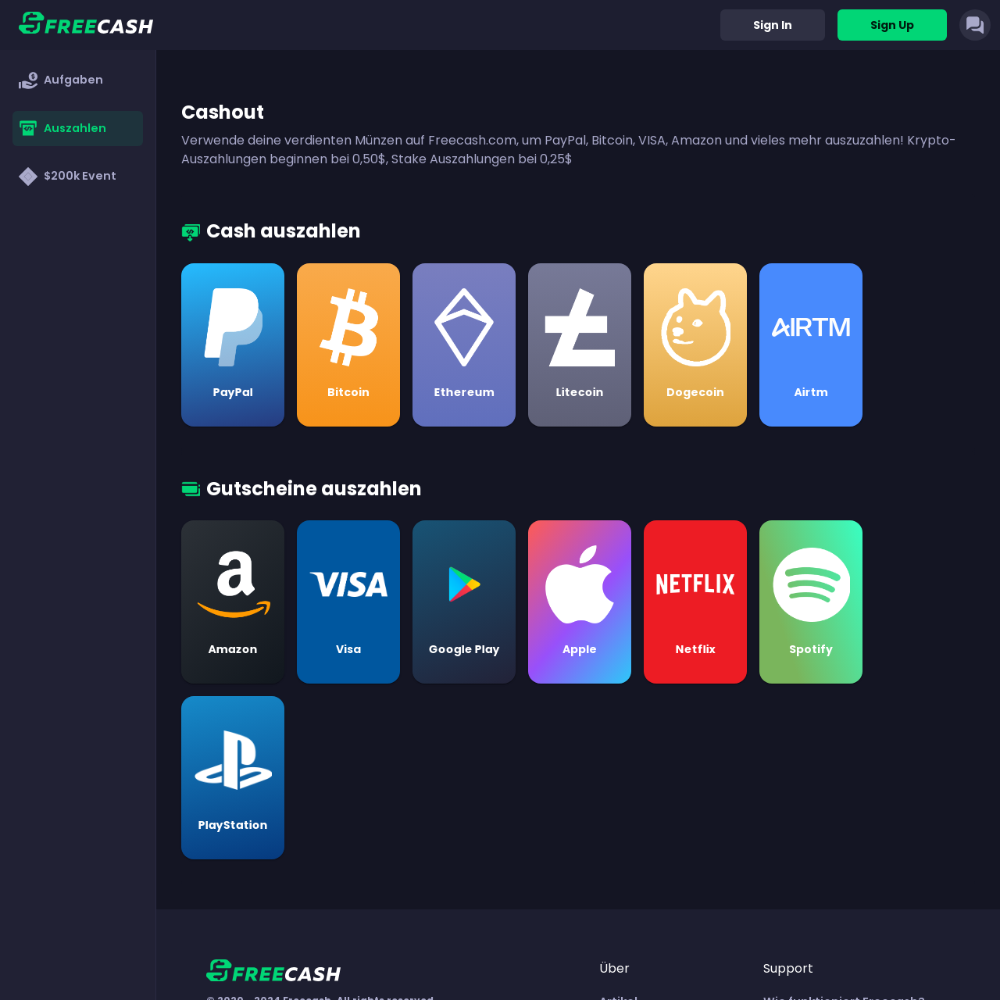
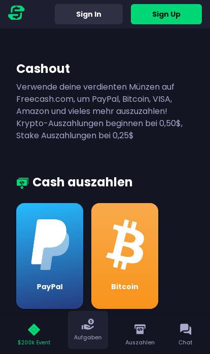
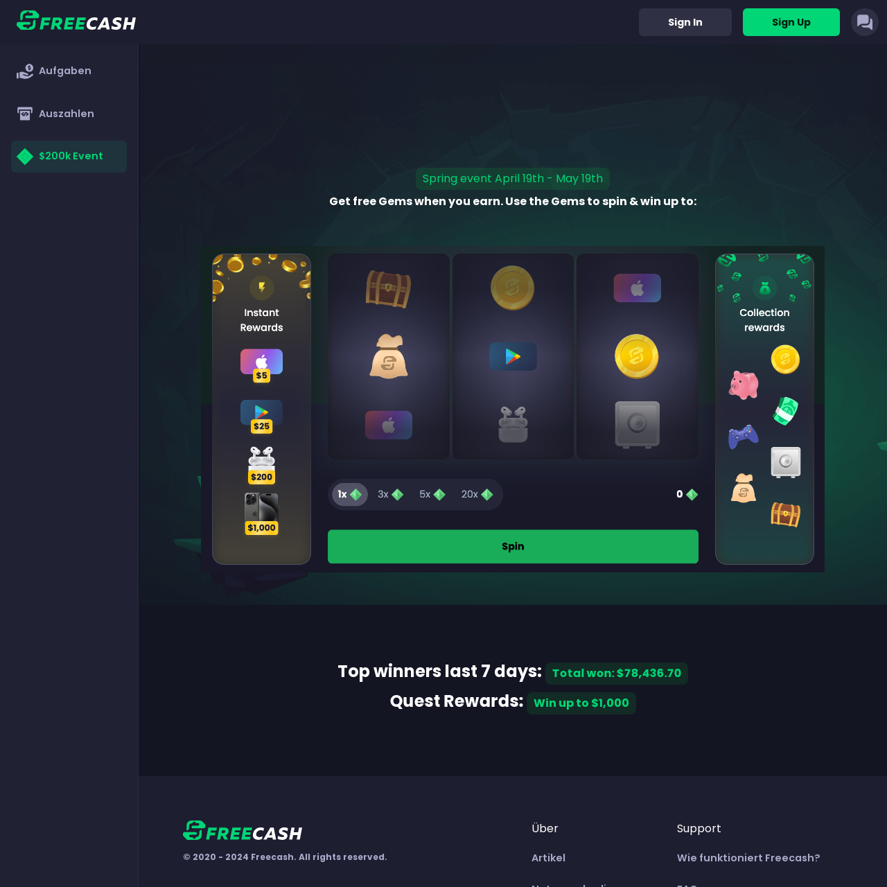

# Freecash

This is a responsive website built using Typescript, React, Context API, Next.js server side rendering and Strapi CMS as the Api service provider. It is created to demonstrate the [freecash.com](https://freecash.com/) design with Next.js App Router.

<h5>
    <a href="https://freecash.vercel.app/" target="blank">Demo</a>
</h5>

<p align="center"></p>
<p align="center"></p>
<p align="center"></p>
<p align="center"></p>
<p align="center"></p>
<p align="center"></p>

## Features

- Server-side rendering
- Responsive design Layout
- User can Sign in and Sign out.
- User can register in the application
- User profile page as part of protected routes
- Earn Page Design
- Cashout Page Design
- Event Page Design
- Chat Design

### Technologies

- [Typescript](https://www.typescriptlang.org/)
- [Node.js (v18.20.2)](https://nodejs.org/)
- [Next.js 14 (App Router)](https://nextjs.org/docs/getting-started/installation/)
- [React JS](https://reactjs.org/)
- [Context API](https://reactjs.org/docs/context.html)
- [Material UI (v5.15.7)](https://mui.com/material-ui/getting-started/installation/)
- [react-hook-form (v7.51.4)](https://react-hook-form.com/get-started#Quickstart/)
- [yup (v1.4.0)](https://github.com/jquense/yup)
- [axios (v1.6.8)](https://axios-http.com/)
- [Date fns (v3.6.0)](https://date-fns.org/docs/Getting-Started#installation/)
- [Strapi CMS](https://strapi.io/)

## Installation Steps

> Please before run the app, take into account to have a node.js v18 installed in your system locally.

1. Clone the repository

```bash
git clone https://github.com/ravisankarchinnam/freecash.git
```

2. Add your keys to .env file in root directory

```bash
#### STRAPI CMS ENV VARS ###
STRAPI_API_KEY=[YOUR_STRAPI_API_KEY]

# LOCALHOST ONLY VALUES #
NEXT_PUBLIC_STRAPI_API_BASE_URL=[YOUR_STRAPI_API_BASE_URL]
```

3. Install dependencies

```bash
npm install
```

4. Run the app in dev mode

```bash
npm run dev
```

> npm run build - which generates a next build folder with all the files ready for the deployment.

## Deployment

This application is deployed to vercel, please use this link to access the site https://freecash.vercel.app/

### Enhancements

> - Implement APIs with GraphQL
> - Setup real database instead of Strapi
> - Chat Integration using sockets
> - Integrate Redux toolkit
> - Write unit tests & cypress test
> - I18N for multiple languages
> - dockerize the Application
> - Lot more possibilities...

## Author

> Ravisankar Chinnam
